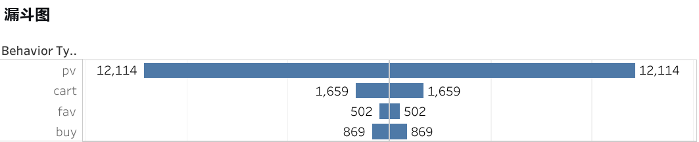
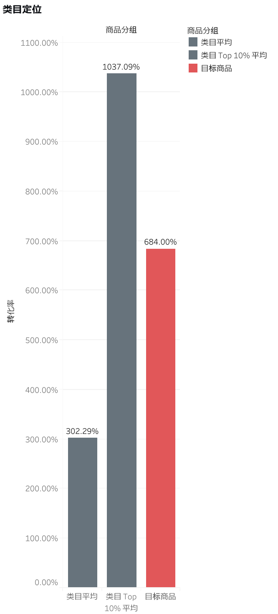
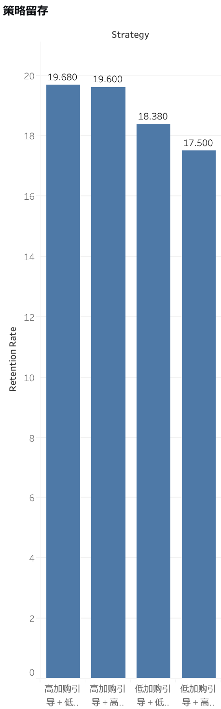

# 电商用户行为全链路分析：单品归因、稳健性检验与策略留存洞察

## 📌 项目概述

**核心问题**：一个类目头部商品的优异表现，究竟是**运营策略有效**，还是**商品自身产品力强**？策略的长期价值又体现在哪里？

本项目基于阿里云天池 **UserBehavior 数据集**（约 1 亿条用户行为日志），选取类目 `2735466` 下的头部商品 `3031354` 进行深度归因，并延伸至同类目 **4,510 个商品**的策略横向对比。通过 **数据清洗 → 稳健性检验 → 反事实归因 → 策略留存分析** 的完整链路，量化“流量质量”与“策略溢价”的贡献，并评估策略对用户长期留存的影响。

> **核心发现**：目标商品的高转化约 95% 源于高意向流量，策略溢价仅约 3.3%，且加购策略的即时转化效果在统计上不显著。但 **“高加购引导”策略在用户留存维度上展现出显著优势**（次日留存高出 2.18 个百分点），说明策略的长期价值被短期指标低估。

## 🧠 分析框架

| 维度 | 内容 |
|:---|:---|
| **O (Objective)** | 量化策略的即时转化贡献与长期留存价值 |
| **S (Strategy)** | ① 排除外部时间干扰 ② 类目横向定位 ③ 反事实模拟剥离溢价 ④ 策略留存对比 |
| **度量 (Measurement)** | 转化率、百分位排名、策略溢价、次日留存率 |

## 📊 在线交互仪表板

👉 **[点击查看 Tableau 交互仪表板]([https://public.tableau.com/views/你的仪表板名称/Sheet1](https://public.tableau.com/views/taobao_analysis/1_1?:language=zh-CN&:sid=&:redirect=auth&:display_count=n&:origin=viz_share_link))**

*（支持悬停查看数据、筛选图例，建议在 PC 端浏览）*

## 📊 数据说明与清洗

- **数据源**：[阿里云天池 UserBehavior 数据集](https://tianchi.aliyun.com/dataset/649)
- **时间窗口**：2017-11-25 至 2017-12-03（共 9 天）
- **原始规模**：约 1 亿条行为记录
- **分析对象**：商品 `3031354`（所属类目 `2735466`）

**清洗流程**：
- **分块读取**：`chunksize=100000` 处理全量数据，避免内存溢出
- **时间过滤**：剔除超出分析窗口的异常时间戳（251 行）
- **去重**：同一用户同一秒同行为保留第一条（0 行重复）
- **完整性验证**：理论入库数 = 实际入库数（20,155 行），零遗漏
- **衍生字段**：`is_buy`、`is_intent`、`daily_pv_count`、`cumulative_actions`

> **数据真实声明**：本分析所有字段均来自原始数据集或其衍生计算，**未使用任何模拟或虚构数据**。用户分层严格基于 **最近购买天数（R）和购买频次（F）** 两个真实维度。

## 🔬 模块一：转化稳定性验证

**目的**：确认商品转化模式不受外部时间因素干扰，为归因分析提供可信前提。

| 对比维度 | 转化率 | p 值 | 结论 |
|:---|:---|:---|:---|
| 工作日 vs 周末 | 5.83% vs 5.82% | 0.978 | 无显著波动 |
| 高曝光日 vs 低曝光日 | 5.96% vs 5.62% | 0.373 | 无显著波动 |
| 预热期 vs 非预热期 | 5.75% vs 5.87% | 0.762 | 无显著波动 |

**结论**：商品转化率高度稳定，外部时间干扰被有效排除。

## 📈 模块二：单品深度归因

### 2.1 转化漏斗

从浏览到购买的独立用户漏斗显示，加购用户数为 1,659，购买用户数为 869，**加购→购买转化率高达 52.4%**，而收藏用户数仅 502。**加购是购买的核心前置动作**，收藏环节形同虚设。

### 2.2 类目横向定位

为清晰呈现目标商品在类目中的位置，我们计算三个关键基准：
- **目标商品**：转化率 6.84%
- **类目 Top 10% 平均**：转化率 5.12%
- **类目平均**：转化率 4.57%

目标商品转化率显著高于类目平均，并超越头部 10% 商品的平均水平，确认其为类目绝对标杆。

### 2.3 反事实模拟：剥离流量质量与策略溢价

**方法**：构建**类目平均模型**，用前 7 天数据训练，预测目标商品后 2 天的“基准转化率”。模型**控制了用户当日行为（浏览、加购次数）与历史行为（是否新用户）**，使预测结果反映“在同等用户特征下，类目平均商品能达到的转化水平”。

**结果**：
- 真实转化率：**5.59%**
- 基准预测转化率：**5.41%**
- **超额溢价：+3.3%**

**解读**：目标商品的高转化约 **95%** 源于吸引了高意向用户，策略溢价有限。

### 2.4 加购策略的即时效果评估

**方法**：在目标商品内部对比“加购用户”与“未加购用户”的实际转化率与基准转化率的差值，并通过 Bootstrap 重采样检验差值是否可靠。

**结果**：加购用户的超额在数值上更高，但差异的波动范围包含了零，**在统计上无法确认为真实效果**。

**结论**：**现有数据不足以证明加购引导策略能独立提升即时转化**。

## 🧪 模块三：策略留存分析

**核心问题**：策略若未显著提升即时转化，是否对用户长期留存有影响？

**方法**：
1. 将**同一类目内**的商品按加购率和日均UV划分为四组策略，**排除类目差异的干扰**。
2. 为每个用户标记其首次接触的商品策略。
3. 计算不同策略组用户的次日留存率，并对比最优与最差策略。

**结果**：

| 策略组合 | 用户数 | 次日留存率 |
|:---|:---:|:---:|
| 高加购引导 + 低曝光 | 7,526 | **19.68%** |
| 高加购引导 + 高曝光 | 155,134 | 19.60% |
| 低加购引导 + 低曝光 | 10,722 | 18.38% |
| 低加购引导 + 高曝光 | 78,267 | 17.50% |

- 最优策略（高加购+低曝光）vs 最差策略（低加购+高曝光）：**留存率高出 2.18 个百分点**
- 比例检验 p < 0.001，**差异极其显著**

**解读**：
- **高加购引导策略的价值在留存维度得以凸显**——它没有显著“逼单”，但筛选或培养了更认可平台的用户。
- **高曝光的双刃剑效应**：在低加购商品上，高曝光反而拉低留存率。曝光必须与加购引导匹配。

## 💡 综合结论与业务建议

### 核心结论

1. **目标商品是类目绝对头部**，转化率、加购率、日均 UV 均处顶尖水平，且时间稳定性极高。
2. **高转化主要源于流量质量**，策略溢价有限，加购策略的即时转化效果在统计上不显著。
3. **策略的长期价值体现在留存**：高加购策略组用户次日留存率显著更高，策略 ROI 需从“短期转化”和“长期留存”双维评估。

### 业务建议

| 发现 | 建议 | 优先级 |
|:---|:---|:---:|
| 高曝光未稀释转化率 | 可放心参与大流量活动，放大头部商品优势 | 高 |
| 加购是购买的核心前置动作 | 优化加购按钮视觉、加购后弹窗引导 | 高 |
| 高加购策略显著提升留存 | 将留存纳入策略评估 KPI，A/B 测试观测周期拉长 | 高 |
| 高曝光在低加购商品上拉低留存 | 低加购商品避免盲目灌流量，先优化加购引导 | 中 |

### 🧪 后续实验设计

| 要素 | 设计 |
|:---|:---|
| **对照组 (A)** | 维持现有策略，不做额外干预 |
| **实验组 (B)** | 对高加购潜力商品加大曝光资源 |
| **核心指标** | 即时转化率 + 次日/7日留存率 |
| **预计周期** | 3-4 周 |

## ⚠️ 局限性声明

1. **数据时间窗口仅 9 天**：结论适用于短期运营决策，长期规律需更多数据验证。
2. **商品产品力变量未控制**：受限于数据字段，反事实模拟未能控制商品价格、上架时长、视觉质量等产品力差异。
3. **策略留存分析存在自选择偏误**：用户自身活跃度可能同时影响其接触高加购策略的概率与留存行为。
4. **观测数据无法确证因果**：策略效应最终需 A/B 测试验证，本报告的归因结论为“在控制已知变量后的最佳估计”。
